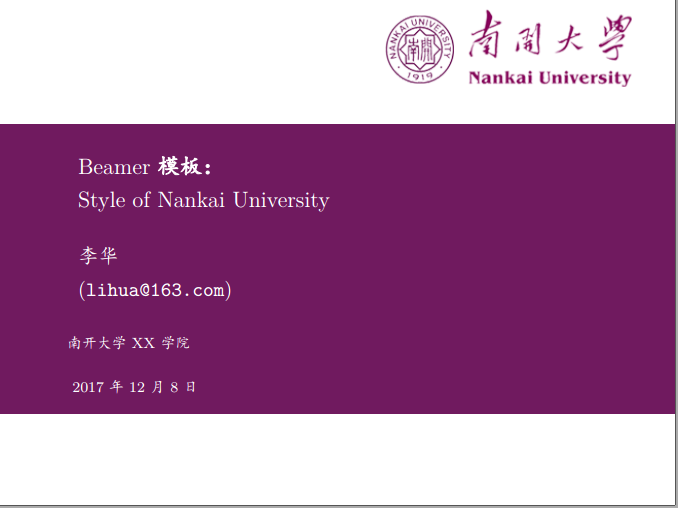
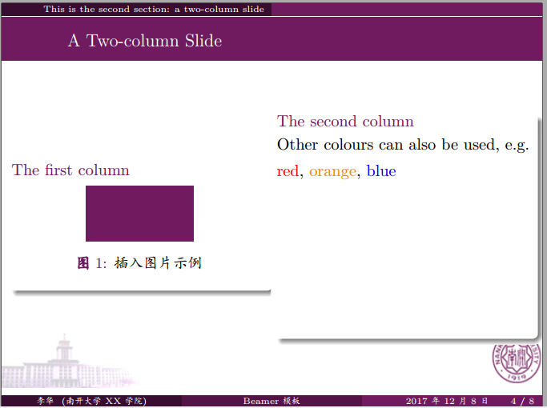
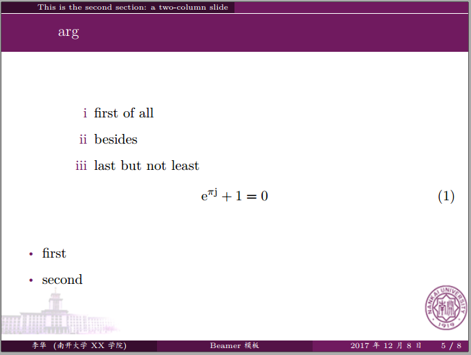
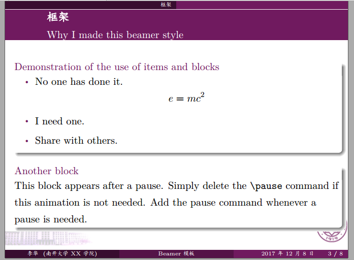

# Beamer-Style-of-NKU
南开大学LaTeX-beamer幻灯片模板
 
## An Unofficial LaTeX beamer style for Nankai University
=======================================================

**NOTE**

1. This is an UNOFFICIAL LaTeX beamer style for Nankai University, the style file is `nkcolor.sty` and the example file is `example.tex`.
2. These files are initially based on Edward Hartley's work <http://www-control.eng.cam.ac.uk/Main/EdwardHartley>. Xiaoke Yang <das.xiaoke@hotmail.com> from BUAA(Beihang University, 北京航空航天大学) gave a beihang version Beamer style from that work.
3. Complaints or suggestions are always welcome.

**Example**

P.S.  Other LaTeX styles or even Markdown styles are also included.
 
P.P.S. 传送门：[南开大学毕业论文LaTeX模板](http://ns.math.nankai.edu.cn/~sunwch/tex/tex.htm)
